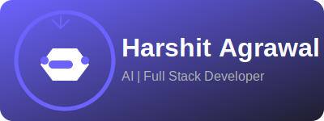

  

---
### 🌟 About Me  

  - 🚀 AI Enthusiast | 💻 Passionate Blogger | 🌐 Tech Innovator 
  
  - 🎨 I love blending creativity with technology, and my journey is centered around writing, building innovative solutions, and learning.
    
  - ✍️ Blogging is my passion because I love to write and share my life experiences

---

### 👀 What I'm Interested In

  - 🤖 Artificial Intelligence & Machine Learning  
  
  - 💻 Software Development & Open-source Contribution
    
  - ✍️ Blogging and writing about technology and innovation

---

### 🌱 **What I’m Learning (Collaborative Approach)**

  - 🔷 Data Structures & Algorithms: Collaborating with others to solve real-world problems and building efficient solutions.  
  
  - 🌐 Front-End Development: Exploring new tools, frameworks, and design patterns to create interactive and user-friendly websites.
     
  - 🛠️ Best Practices: Engaging in discussions on software development methodologies, project management, and code quality. 

---

### 💞️ **What I’m Looking to Collaborate On**

  - 🌍 Open-source projects focused on AI, software development, and automation
  
  - ✍️ Writing collaborative blogs, tutorials, or articles on emerging tech topics
    
  - 🛠️ Working on Python-based automation tools or frameworks
    
  - 🎨 Collaborative front-end projects to build innovative and visually stunning websites
     
  - 🍂 Open-source contributions and Hacktoberfest challenges  

---

### 🛠️ **Skills & Technologies**

#### **Languages**  

  ![Python]	(https://img.shields.io/badge/Python-3776AB?style=for-the-badge&logo=python&logoColor=white) 
    

#### **Web Development**  

  
    

---

### 📬 Get in Touch:

  
  
  

---

### 🚀 **Future Goals**

  - Build a scalable **AI-driven application**  
  - Participate in **Google Summer of Code (GSoC)**  
  - Continue to grow as a **tech writer** and share more articles and tutorials  
  - Contribute to **open-source projects** that help others grow

